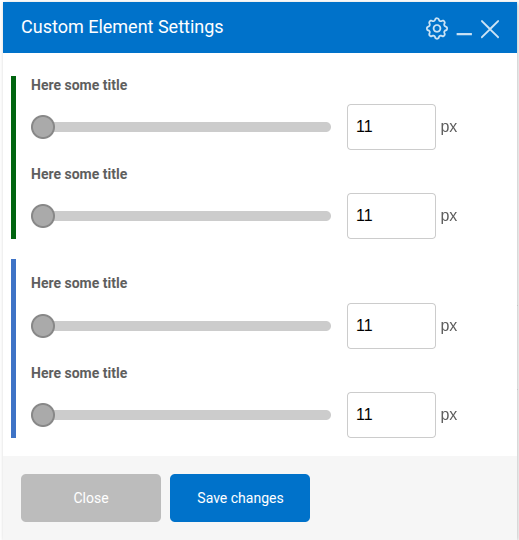

## Description

This is a collection of additional [custom element param types](https://kb.wpbakery.com/docs/developers-how-tos/create-new-param-type) for [WPBakery Page Builder](https://wpbakery.com/) wordpress plugin.
By default, WPBakery already has a lot of [pre-defined element param types](https://kb.wpbakery.com/docs/inner-api/vc_map/#vc_map()-paramsArray), but if you need even more customization with your WPBakery editor custom elements, this is a great collection of additional element params for it.

## How To Install

### 1. As a regular WordPress plugin.

Clone this repo to your wp-content/plugins folder of your wordpress project.
```bash
git clone https://github.com/OlegApanovich/wpbakery-custom-param-collection.git
```
Then go to wordpress dashboard plugins section, and activate the newly installed "WPBakery Custom Param Collection" plugin there.
That's it. Now you can specify any custom parameters from the list below in your custom WPBakery element, and they will appear in your element edit popup.

Alternatively, if you have WP-CLI set up, you can install and activate the plugin using a terminal command.
```bash
wp plugin install https://github.com/OlegApanovich/wpbakery-custom-param-collection/archive/refs/heads/main.zip --activate --force
```

### 2. Include in WordPress theme/plugin
Clone this repo to your theme/plugin folder.

```bash
git clone https://github.com/OlegApanovich/wpbakery-custom-param-collection.git
```

Then, if you include to the theme, add this code to your functions.php file, or if you use a plugin, add it to the main plugin file.
```php
add_action( 'admin_init', function() {
	include __DIR__ .  '/wpbakery-custom-param-collection/wpbakery-custom-param-collection.php';
} );

Please note that if you include it in your theme/plugin, then disable wpbakery-custom-param-collection plugin, otherwise you will get a fatal error.
```

## Collection List

### 1. Number

__type__ : custom_number

__Description:__
Regular input with a type number.

__Screnshot:__


__Param Attributes:__

| Name | Type | Requred | Description | 
|----------|----------|----------|----------|
| param_name    | string     | yes     | Param slug. |
| value    | string     | no     | Predefind value. Can be float like '0.1'. |
| min    | string     | no     | Minimum value for input. Can be float like '0.1'. | 
| max    | string     | no     | Maximum value for input. Can be float like '0.1'. |
| step    | string     | no     | The Input step when you click the up/down buttons. Can be float like '0.1'. |
| title    | string     | no     | Additional title in the end of input |

__Exemple:__

```php
add_action( 'vc_before_init', 'integrate_custom_param' );
function integrate_custom_param() {
    vc_map( [
        "name" => __( "Custom Element", "my-text-domain" ),
        "base" => "bartag",
        "category" => __( "Content", "my-text-domain"),
        "params" => [
            [
                'type'        => 'custom_number',
                'value'         => '2.1',
                'min'         => '0.1',
                'max'         => '5.5',
                'step'        => '0.1',
                'heading'     => esc_html__( 'Border Width', 'my-text-domain' ),
                'param_name'  => 'marker_border_width',
                'title'       => esc_html__( 'px', 'my-text-domain' ),
                'description' => esc_html__( 'Set custom border width in px from.', 'my-text-domain' ),
            ]
        ]
    ] );
}
```

### 2. Notice

__type__ : custom_notice

__Description__
The [native wordpress notice](https://developer.wordpress.org/block-editor/how-to-guides/notices/) looks like text output to the element edit window.

__Screnshot:__


__Param Attributes:__

| Name | Type | Requred | Description | 
|----------|----------|----------|----------|
| param_name    | string     | yes     | Param slug. |
| notice    | string     | no     | Notice text. |
| level    | string     | no     | On a level depends the color of the notice UI. There are 4 value levels available (info, warning, error, success). If the level is not specified, the notice will be grey.  |

__Exemple:__

```php
add_action( 'vc_before_init', 'integrate_custom_param' );
function integrate_custom_param() {
    vc_map( [
        "name" => __( "Custom Element", "my-text-domain" ),
        "base" => "bartag",
        "category" => __( "Content", "my-text-domain"),
        "params" => [
            [
                'type'        => 'custom_notice',
                'param_name'  => 'custom_notice_info',
                'level'       => 'info',
                'notice'      => __('Here is info notice.', 'my-text-domain'),
            ],
            [
                'type'        => 'custom_notice',
                'param_name'  => 'custom_notice_warning',
                'level'       => 'warning',
                'notice'      => __('Here is warning notice.', 'my-text-domain'),
            ],
            [
                'type'        => 'custom_notice',
                'param_name'  => 'custom_notice_error',
                'level'       => 'error',
                'notice'      => __('Here is error notice.', 'my-text-domain'),
            ],
            [
                'type'        => 'custom_notice',
                'param_name'  => 'custom_notice_success',
                'level'       => 'success',
                'notice'      => __('Here is success notice.', 'my-text-domain'),
            ],
            [
                'type'        => 'custom_notice',
                'param_name'  => 'custom_notice_empty',
                'notice'      => __('Here is empty level notice.', 'my-text-domain'),
            ],
        ]
    ] );
}
```

### 3. Switcher

__type__ : custom_switcher

__Description:__
Yes/no type switcher.

__Screnshot:__


__Param Attributes:__

| Name | Type | Requred | Description | 
|----------|----------|----------|----------|
| param_name    | string     | yes     | Param slug. |
| option    | array     | yes     | Switcher options |
| value    | string     | no     | Set here the value the same as the options key if you wanna switch on by default.  |

__Exemple:__

```php
add_action( 'vc_before_init', 'integrate_custom_param' );
function integrate_custom_param() {
    vc_map( [
        "name" => __( 'Custom Element', 'my-text-domain' ),
        'base' => 'bartag',
        'category' => __( 'Content', 'my-text-domain'),
        'params' => [
            [
                'type'        => 'custom_switcher',
                'param_name'  => 'custom_switcher_example',
                'options'     => [
                    'open_value' => [
                        'label' => '',
                        'on'    => __( 'Yes', 'my-text-domain' ),
                        'off'   => __( 'No', 'my-text-domain' ),
                    ],
                ],
                'value' => 'open_value',
            ],
        ]
    ] );
}
```

### 4. Number Slider

__type__ : custom_number_slider

__Description:__
Regular input with a type number and a slider that helps regulate the input value.

__Screnshot:__


__Param Attributes:__

| Name | Type | Requred | Description | 
|----------|----------|----------|----------|
| param_name    | string     | yes     | Param slug. |
| value    | string     | no     | Predefind value. Can be float like '0.1'. |
| min    | string     | no     | Minimum value for input. Can be float like '0.1'. | 
| max    | string     | no     | Maximum value for input. Can be float like '0.1'. |
| step    | string     | no     | The Input step when you click the up/down buttons. Can be float like '0.1'. |
| title    | string     | no     | Additional title in the end of input |

__Exemple:__

```php
add_action( 'vc_before_init', 'integrate_custom_param' );
function integrate_custom_param() {
    vc_map( [
        "name" => __( 'Custom Element', 'my-text-domain' ),
        'base' => 'bartag',
        'category' => __( 'Content', 'my-text-domain'),
        'params' => [
            [
                'type'        => 'custom_number_slider',
                'param_name'  => 'custom_number_slider_example',
                'heading' => 'Here some title',
                'title' => 'px',
                'min' => 11,
                'max' => 100,
                'step' => 1,
            ],
        ]
    ] );
}
```

### 5. WYSIWYG TinyMCE

__type__ : custom_wysiwyg

__Description:__
By default, WPBakery supports only one WYSIWYG TinyMCE parameter type — textarea_html — per element. With this custom parameter, you can add as many WYSIWYG TinyMCE parameters to a single element as you want.

__Screnshot:__


__Param Attributes:__

 Name        | Type   | Required | Description |
|-------------|--------|----------|-------------|
| param_name  | string | yes      | Param slug. |
| value       | string | yes      | Even if you don't want a predefined value here, specify at least an empty string. |
| minimal     | "true" or "false"   | no       | Display TinyMCE editor with minimal options. Default: `"false"`. |
| scope       | array  | no       | Disable or override TinyMCE features. Default: `[ 'use_tabs' => 'true', 'use_menubar' => 'true', 'use_media' => 'true', 'use_link' => 'true', 'use_lists' => 'true', 'use_blockquote' => 'true', 'use_textcolor' => 'true', 'use_background' => 'true', 'use_rootblock' => 'p' ]`. |

__Exemple:__

```php
add_action( 'vc_before_init', 'integrate_custom_param' );
function integrate_custom_param() {
	vc_map( [
		"name" => __( 'Custom Element', 'my-text-domain' ),
		'base' => 'bartag',
		'category' => __( 'Content', 'my-text-domain'),
		'params' => [
 			[
				'type'       => 'custom_wysiwyg',
				'param_name' => 'custom_wysiwyg_example',
				'value'      => '',
				'scope'      => [
					'use_menubar'    => 'false',
					'use_media'      => 'false',
				]
			],
        ]
    ] );
}
```
### 6. Divider

__type__ : custom_divider

__Description:__
Divider help group param visually, divide them with line separator with title.

__Screnshot:__


__Param Attributes:__

 Name        | Type   | Required | Description |
|-------------|--------|----------|-------------|
| param_name  | string | yes      | Param slug. |
| title       | string | no      | Title above separator line. |
| subtitle       | string | no      | Subtitle under separator line. |
| title_description       | string | no      | Analog description for a regular parameter. Visible as a tooltip near the title. |
| color       | string | no      | Separator line color. |

__Exemple:__

```php
add_action( 'vc_before_init', 'your_name_integrate' );
function your_name_integrate() {
    vc_map( [
        "name" => __( 'Custom Element', 'my-text-domain' ),
        'base' => 'bartag',
        'category' => __( 'Content', 'my-text-domain'),
        'params' => [
            [
                'type'              => 'custom_divider',
                'param_name'        => 'custom_divider_example',
                'title'             => __( 'Title Example', 'my-text-domain' ),
                'title_description' => __( 'Group Description', 'my-text-domain' ),
                'subtitle'          => __( 'Subtitle Example', 'my-text-domain' ),
                'color'             => '#4873c9',
            ],
        ]
    ] );
}
```
## Bonus
Additionally to custom parameter collection, we provide functionality to group parameters together. In the edit element popup, this will be visible as a border on the right side of the parameter.
To enable this, you need to provide an additional parameter attribute called 'wcp_group' with the value true.

__Screnshot:__



__Exemple:__

```php
add_action( 'vc_before_init', 'your_name_integrate' );
function your_name_integrate() {
    vc_map( [
        "name" => __( 'Custom Element', 'my-text-domain' ),
        'base' => 'bartag',
        'category' => __( 'Content', 'my-text-domain'),
        'params' => [
            [
                'type'        => 'custom_number_slider',
                'param_name'  => 'custom_number_slider_example',
                'heading' => 'Here some title',
                'wcp_group' => true,
                'wcp_group_color' => '#006400',
                'title' => 'px',
                'min' => 11,
                'max' => 100,
                'step' => 1,
            ],
            [
                'type'        => 'custom_number_slider',
                'param_name'  => 'custom_number_slider_example_2',
                'wcp_group' => true,
                'wcp_group_color' => '#006400',
                'heading' => 'Here some title',
                'title' => 'px',
                'min' => 11,
                'max' => 100,
                'step' => 1,
            ],

            [
                'type'        => 'custom_number_slider',
                'param_name'  => 'custom_number_slider_example3',
                'heading' => 'Here some title',
                'wcp_group' => true,
                'wcp_group_margin_top' => '20',
                'title' => 'px',
                'min' => 11,
                'max' => 100,
                'step' => 1,
            ],
            [
                'type'        => 'custom_number_slider',
                'param_name'  => 'custom_number_slider_example_4',
                'wcp_group' => true,
                'heading' => 'Here some title',
                'title' => 'px',
                'min' => 11,
                'max' => 100,
                'step' => 1,
            ],
        ]
    ] );
}
```
