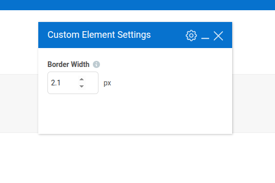

## Description

This is a collection of additional [custom element param types](https://kb.wpbakery.com/docs/developers-how-tos/create-new-param-type) for [WPBakery Page Builder](https://wpbakery.com/) wordpress plugin.
By default, WPBakery already has a lot of [pre-defined element param types](https://kb.wpbakery.com/docs/inner-api/vc_map/#vc_map()-paramsArray), but if you need even more customization with your WPBakery editor custom elements, this is a great collection of additional element params for it.

## How To Install

### 1. As a regular WordPress plugin.

Clone this repo to your wp-content/plugins folder of your wordpress project.
```bash
git clone https://github.com/OlegApanovich/wpbakery-custom-param-collection.git
```
Then go to wordpress dashboard plugins section, and activate the newly installed "WPBakery Custom Param Collection" plugin there.
That's it. Now you can specify any custom parameters from the list below in your custom WPBakery element, and they will appear in your element edit popup.

### 2. Include in WordPress theme/plugin
Clone this repo to your theme/plugin folder.

```bash
git clone https://github.com/OlegApanovich/wpbakery-custom-param-collection.git
```

Then, if you include to the theme, add this code to your functions.php file, or if you use a plugin, add it to the main plugin file.
```php
add_action( 'admin_init', function() {
	include __DIR__ .  '/wpbakery-custom-param-collection/wpbakery-custom-param-collection.php';
} );
```

## Collection List

### 1. Number

__type__ : custom-number

__Description:__
Regular input with a type number.

__Screnshot:__



__Param Attributes:__

| Name | Type | Requred | Description | 
|----------|----------|----------|----------|
| param_name    | string     | yes     | Param slug. |
| value    | string     | no     | Predefind value. Can be float like '0.1'. |
| min    | string     | no     | Minimum value for input. Can be float like '0.1'. | 
| max    | string     | no     | Maximum value for input. Can be float like '0.1'. |
| step    | string     | no     | The Input step when you click the up/down buttons. Can be float like '0.1'. |
| title    | string     | no     | Additional title in the end of input |

__Exemple:__

```php
add_action( 'vc_before_init', 'your_name_integrate' );
function your_name_integrate() {
    vc_map( [
        "name" => __( "Custom Element", "my-text-domain" ),
        "base" => "bartag",
        "category" => __( "Content", "my-text-domain"),
        "params" => [
            [
                'type'        => 'custom-number',
                'value'         => '2.1',
                'min'         => '0.1',
                'max'         => '5.5',
                'step'        => '0.1',
                'title'        => 'px',
                'heading'     => esc_html__( 'Border Width', 'my-text-domain' ),
                'param_name'  => 'marker_border_width',
                'title'       => esc_html__( 'px', 'my-text-domain' ),
                'description' => esc_html__( 'Set custom border width in px from.', 'my-text-domain' ),
            ]
        ]
    ] );
}
```

### 2. Notice

__type__ : custom-notice

__Description__
Output the [native wordpress notice](https://developer.wordpress.org/block-editor/how-to-guides/notices/) looks like text output to the element edit window.

__Screnshot:__


__Param Attributes:__

| Name | Type | Requred | Description | 
|----------|----------|----------|----------|
| param_name    | string     | yes     | Param slug. |
| notice    | string     | no     | Notice text. |
| level    | string     | no     | On a level depends the color of the notice UI. There are 4 value levels available (info, warning, error, success). If the level is not specified, the notice will be grey.  |

__Exemple:__

```php
add_action( 'vc_before_init', 'your_name_integrate' );
function your_name_integrate() {
    vc_map( [
        "name" => __( "Custom Element", "my-text-domain" ),
        "base" => "bartag",
        "category" => __( "Content", "my-text-domain"),
        "params" => [
            [
                'type'        => 'custom-notice',
                'param_name'  => 'custom_notice_info',
                'level'       => 'info',
                'notice'      => __('Here is info notice.', 'my-text-domain'),
            ],
            [
                'type'        => 'custom-notice',
                'param_name'  => 'custom_notice_warning',
                'level'       => 'warning',
                'notice'      => __('Here is warning notice.', 'my-text-domain'),
            ],
            [
                'type'        => 'custom-notice',
                'param_name'  => 'custom_notice_error',
                'level'       => 'error',
                'notice'      => __('Here is error notice.', 'my-text-domain'),
            ],
            [
                'type'        => 'custom-notice',
                'param_name'  => 'custom_notice_success',
                'level'       => 'success',
                'notice'      => __('Here is success notice.', 'my-text-domain'),
            ],
            [
                'type'        => 'custom-notice',
                'param_name'  => 'custom_notice_empty',
                'notice'      => __('Here is empty level notice.', 'my-text-domain'),
            ],
        ]
    ] );
}
```

### 3. Switcher

__type__ : custom-switcher

__Description:__
Output the yes/no type switcher.

__Screnshot:__


__Param Attributes:__

| Name | Type | Requred | Description | 
|----------|----------|----------|----------|
| param_name    | string     | yes     | Param slug. |
| option    | array     | yes     | Switcher options |
| value    | string     | no     | Set here the value the same as the options key if you wanna switch on by default.  |

__Exemple:__

```php
add_action( 'vc_before_init', 'your_name_integrate' );
function your_name_integrate() {
    vc_map( [
        "name" => __( 'Custom Element', 'my-text-domain' ),
        'base' => 'bartag',
        'category' => __( 'Content', 'my-text-domain'),
        'params' => [
            [
                'type'        => 'custom-switcher',
                'param_name'  => 'custom_switcher_example',
                'options'     => array(
                    'open_value' => array(
                        'label' => '',
                        'on'    => __( 'Yes', "my-text-domain" ),
                        'off'   => __( 'No', "my-text-domain" ),
                    ),
                ),
                'value' => 'open_value',
            ],
        ]
    ] );
}
```
